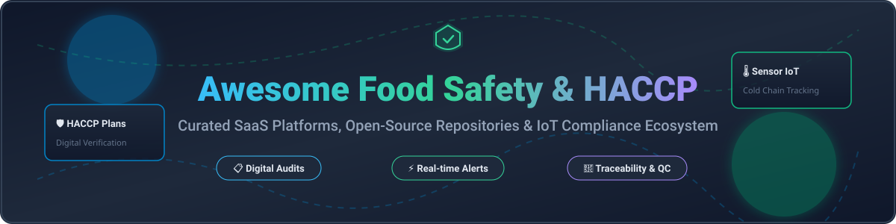

  

# 🍕 Awesome Food Safety & HACCP 🛡️

  

> **A curated list of top SaaS products, open-source GitHub software repositories, digital HACCP compliance engines, temperature IoT monitoring systems, and food safety platforms.** 🚀

---

## 📑 Table of Contents
- [📊 Ecosystem Market Overview](#-ecosystem-market-overview)
- [🏢 SaaS & Commercial Platforms](#-saas--commercial-platforms)
- [💻 Open-Source GitHub Projects](#-open-source-github-projects)
- [🤝 How to Contribute](#-how-to-contribute)
- [☕ Support & Community](#-support--community)
- [📈 Star History](#-star-history)
- [⚠️ Disclaimer](#%EF%B8%8F-disclaimer)

---

## 📊 Ecosystem Market Overview 🌐

The global **Food Safety & HACCP Software Market** was estimated at **USD 1.6 Billion in 2024** and is projected to reach **USD 2.8 Billion by 2030** (CAGR of 9.7%). 

Market fragmentation analysis indicates that the sector is **moderately fragmented**. It is populated by specialized SaaS vendors (e.g. FoodDocs, Safefood 360°), IoT hardware/sensor platforms (SmartSense, Checkit), and enterprise restaurant execution tools (Jolt). While larger parent technology conglomerates (such as Digi International and Ideagen) are steadily consolidating players, there is currently no single "winner-take-all" monopoly, allowing specialized vertical software and open-source tools to thrive across different operator tiers. 📈

---

## 🏢 SaaS & Commercial Platforms 🏷️

Below is a structured overview of leading commercial food-safety, audit, and HACCP compliance platforms, ordered by company size/revenue (descending).

| Platform 🛠️ | Description 📝 | Company Size / Scale (Est. Revenue/Valuation) 💰 | Starting Pricing 💵 | Free Tier / Trial Limits ⏳ |
| :--- | :--- | :--- | :--- | :--- |
| **[SmartSense](https://www.smartsense.co/)** | Environmental & IoT cold chain sensor monitoring platform with automated compliance reporting. | **$430M+ Revenue** (Parent: Digi International, NASDAQ: DGII) | Custom hardware + software subscription (Asset-based) | No free trial; live enterprise demo available upon request |
| **[SafetyCulture (iAuditor)](https://safetyculture.com/)** | Global inspection and checklist platform used extensively for food safety audits and issue management. | **$197M Revenue** ($1.7B+ Valuation) | Free tier available; paid from $24/user/month (billed annually) | **Free Forever Plan** available (up to 10 team members & 100 inspection submissions/month) |
| **[Safefood 360°](https://safefood360.com/)** | Enterprise food-safety management system (FSMS) covering HACCP, supplier controls, and compliance for food manufacturing. | **$100M+ Revenue** (Parent: Ideagen / LGC Group) | Custom annual recurring subscription (Quote-based) | No free tier; custom demo sandbox available for enterprise evaluations |
| **[Checkit](https://www.checkit.net/)** | Connected workplace solution integrating IoT temperature sensors, workflow checklists, and operational dashboards. | **$15M+ Revenue** (LSE: CKT) | Custom location-based quote | No public free trial; interactive product demo available |
| **[Jolt](https://www.jolt.com/)** | Digital Operations platform for restaurants featuring temperature logs, hygiene checklists, and team accountability. | **$16.5M Revenue** (Acquired by Digi International) | Starting from $89.99/location/month | No standard free trial; customized demo provided |
| **[Trail App](https://www.trailapp.com/)** | Smart operational checklist and food-safety routine app designed for multi-unit hospitality operators. | **$3M–$5M Est. Revenue** | Starting from £32 (~$42)/site/month (Team plan) | **14-Day Free Trial** (Full access, no credit card required) |
| **[MeazureUp](https://www.meazureup.com/)** | Multi-location restaurant management software focusing on digital site audits, checklists, and food safety standards. | **$2M–$5M Est. Revenue** | Custom quote per location | No free plan; free demo available upon request |
| **[ComplianceMate](https://compliancemate.com/)** | IoT-driven food safety platform providing continuous monitoring and real-time alerts for temperature compliance. | **$2M–$5M Est. Revenue** | Custom hardware/software subscription | No public free trial; demo environment available |
| **[FoodDocs](https://www.fooddocs.com/)** | AI-assisted HACCP plan builder and digital food safety system for compliance automation. | **$1M Est. Revenue** | Starting from $84/site/month (billed annually) | **14-Day Free Trial** (Full feature access, no credit card required) |
| **[HACCP Now](https://www.haccpnow.co.uk/)** | Digital HACCP compliance tool enabling small food businesses to generate and maintain HACCP documentation. | **<$1M Est. Revenue** | Starting from £15 (~$20)/month | **7-Day Free Trial** available |

---

## 💻 Open-Source GitHub Projects 🔓

Below is a curated selection of open-source software, sensor data collectors, and digital inspection engines applicable to food safety, hygiene, and kitchen operations. Ranked by GitHub_Stars (descending).

| Project 📦 | Stars_Count ⭐️ | Description 📝 | Category 🏷️ |
| :--- | :--- | :--- | :--- |
| **[home-assistant/core](https://github.com/home-assistant/core)** |  | Open-source home automation hub widely utilized for custom IoT kitchen temperature monitoring, cold-chain sensor logging, and real-time alert triggers. | IoT & Sensor Collection 🌡️ |
| **[invoiceninja/invoiceninja](https://github.com/invoiceninja/invoiceninja)** |  | Self-hosted management engine often extended by food processors for client management, supplier invoicing, and basic batch/order tracking. | Operations & Audit Trail 📄 |
| **[grocy/grocy](https://github.com/grocy/grocy)** |  | ERP & management platform for residential and commercial kitchens featuring stock tracking, expiry dates, barcode processing, and meal prep tracking. | Kitchen & Stock Management 🥗 |
| **[formio/formio](https://github.com/formio/formio)** |  | Combined JSON form builder and server layer used to create offline-capable mobile food hygiene checklists and digital HACCP inspection forms. | Digital Form & Checklist Engine 📋 |
| **[CFSAN-Biostatistics/snp-pipeline](https://github.com/CFSAN-Biostatistics/snp-pipeline)** |  | FDA CFSAN bioinformatics pipeline for producing SNP matrices from sequence data used in phylogenetic analysis of foodborne pathogens. | Food Safety Pathogen Research 🔬 |
| **[justanesta/food_safety_recalls](https://github.com/justanesta/food_safety_recalls)** |  | Automated data repository capturing and structuring official public food safety recall announcements published by the FDA and USDA. | Recall Data & Hazard Explorer ⚠️ |
| **[bobjac/food-safety-sample](https://github.com/bobjac/food-safety-sample)** |  | Reference implementation utilizing Azure IoT Hub and Blockchain ledger for tracking cold-chain food lifecycle via Raspberry Pi sensors. | IoT & Blockchain Traceability ⛓️ |
| **[rmunro/food_safety](https://github.com/rmunro/food_safety)** |  | Machine learning code samples and annotation workflows focused on identifying food safety violations from unstructured text and inspect records. | Machine Learning & Analytics 🤖 |
| **[jonathanhild/foodsafetyexplorer](https://github.com/jonathanhild/foodsafetyexplorer)** |  | Interactive web dashboard and exploratory analysis interface for searching European and global food safety recall reports. | Public Hazard Explorer 🌍 |

---

## 🤝 How to Contribute 📝

Contributions are very welcome! 

1. **Fork** this repository 🍴
2. **Create** a new feature branch (`git checkout -b add-food-safety-tool`) 🔀
3. **Commit** your formatted changes (`git commit -m 'Add New Digital HACCP SaaS'`) 💾
4. **Push** to the branch (`git push origin add-food-safety-tool`) 🚀
5. **Open** a Pull Request 📩

---

## ☕ Support & Community ❤️

If you find this repository helpful in navigating the Food Safety, HACCP, and IoT Compliance ecosystem, please consider supporting the project!

- ⭐ **Star** this repository to show support and increase visibility.
- 🔄 **Fork** and share it with fellow food-safety quality managers, auditors, and engineers.
- ☕ **Sponsor**: Buy me a coffee via the [GitHub Sponsor Dashboard](https://github.com/sponsors/ishandutta2007)!

---

## 📈 Star History

---

## ⚠️ Disclaimer 📜

- This list is **community-curated** for educational, operational reference, and research purposes.
- Food safety, HACCP verification, and sanitation regulations impact public health. Open-source or digital form tools are **not** automatic substitutes for certified FSMS implementations or regulatory compliance advice.
